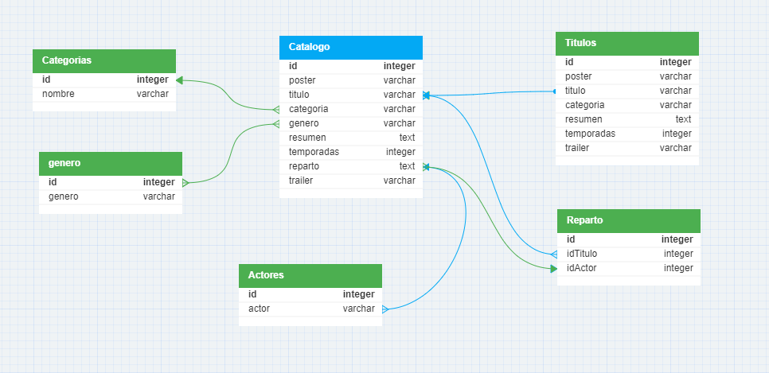

# Descripción del Proyecto

Este proyecto utiliza Node.js y Express para crear un servidor web que proporciona una API para acceder a información sobre categorías y catálogo de películas/series. Se utiliza Sequelize como ORM para interactuar con una base de datos.

## Instalación

1. Clona este repositorio en tu máquina local.
2. Instala las dependencias usando `npm install`.

## Configuración

Crea un archivo `config.js` en la raíz del proyecto con la siguiente estructura:

```javascript
module.exports = {
  database: 'nombre_de_la_base_de_datos',
  username: 'usuario_de_la_base_de_datos',
  password: 'contraseña_de_la_base_de_datos',
  host: 'host_de_la_base_de_datos',
  dialect: 'dialecto_de_la_base_de_datos' // Ej. 'mysql'
};
Reemplaza 'nombre_de_la_base_de_datos', 'usuario_de_la_base_de_datos', 'contraseña_de_la_base_de_datos', 'host_de_la_base_de_datos' y 'dialecto_de_la_base_de_datos' con tu configuración.

```
## Uso
1. Ejecuta la aplicación usando npm start.
2. Accede a la API en http://localhost:3000.


## Endpoints
```javascript
* GET /categorias: Obtiene todas las categorías.
* GET /catalogo: Obtiene todo el catálogo.
* GET /catalogo/id/:id: Obtiene un elemento del catálogo por su ID.
* GET /catalogo/nombre/:nombre: Busca elementos del catálogo por nombre.
* GET /catalogo/genero/:genero: Busca elementos del catálogo por género.
* GET /catalogo/categoria/:categoria: Busca elementos del catálogo por categoría.
```
## Imagen DBdesigner


